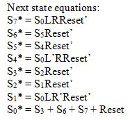

# Lab 3 - Thunderbird Turn Signal - Dom Celiano

## Objectives/Purpose
The purpose of this lab was to design, write, test, and implement in hardware using VHDL a finite state machine to simulate the taillights of a 1965 Thunderbird. The lights of the T-bird light sequentially when the left or right blinker is pressed, as seen below in Figure 1.

######FIGURE 1 - the turn signal lighting sequence of the 1965 ford thunderbird. LA-LC represents the left blinker, while RA-RC is the right blinker. After the sequence is finished, all the lights turn off.
In order to create this lighting sequence, an FSM was written and tested, and eventually transfered over to the Nexys2 FPGA board.

## Preliminary design and diagrams
To start, each of the 6 lights to be simulated on the Thunderbird were given a name: LA, LB, LC, RA, RB, and RC. This labeling can be seen in Figure 2.

######FIGURE 2 - the 6 labels for the tail lights of the thunderbird. these labels correspond to figure 1.
After each of the lights were labeled, a state transition diagram was created to show the different states that the lights could be in and the transitions between the states. This diagram can be seen in Figure 3.

######FIGURE 3 - the state transition diagram for the thunderbird FSM. The FSM contains 8 states, s0-s7. s0 is a state in which all the lights are off. from that state, the fsm can move to the left turning sequence, the right turning sequence, or a 'hazard light' scenario in which both the right and left inputs were given.
As can be seen in this state diagram, the FSM starts out in S0 and reverts back to S0 after each light sequence. The sequence of S1-S3 occurs when only a left input is given, while the sequence of S4-S6 occurs when only a right input is given. The S7 sequence is the hazard lights and occurs when both right and left inputs are given. Inside the circles of the state diagram, the output (high or low) of each of the 6 LEDs is given. Another important point to note in this diagram is that after any of the three light sequences are entered, it does not matter what input is given by the user - they will move through their entire sequence and then return to s0.

Once the state diagram for the Thunderbird FSM had been created, it was time to write out the next state table and next state equation. These tables and equations would make writing the VHDL code later a lot easier. The result of this work can be seen in Figures 4 and 5.

######FIGURE 4 - the next state table for the thunderbird fsm. the current state is on the left, the three possible inputs in the middle, and the next state on the right of the table. This table was created by looking at the arrows on the state diagram in figure 3.

######FIGURE 5 - the next state equations for the thunderbird fsm, derived from the next state table in figure 4. these were useful when writing the vhdl code.
After the next state table and equations were worked out, it was time to move onto the output table and output equations. These can be seen in Figures 6 and 7.

######FIGURE 6 - output table for the thunderbird fsm. the 6 led outputs depend on the current state of the fsm, and are determined by looking at the state diagram in figure 3.

######FIGURE 7 - output equations for the thunderbird fsm, determined using the table in figure 6. these equations were extremely helpful when the vhdl code was written.
After the next state and output logic was determined to help write the VHDL code, it was finally time to dive into the VHDL code. The FSM had 4 inputs: left, right, reset, and the clock and 6 outputs: the 6 LEDs. The output was split up into 2 busses of 3 LEDs, with each bus representing the left or right taillight. The first thing that was necessary to do was to define the 8 state types that were possible: S0-S7. Once that was done, the signals 'state' and 'nextstate' were defined to be of type statetype. This let these signals take on the values of S0-S7. This code can be seen in Figure 8.

######FIGURE 8 - 
After the state and nextstate signals were defined, it was time to move into the state register part of the VHDL code. A process was created that only ran when clk or reset changed, and changed the state to next state on the rising edge of the clock. 

After the state register part of the VHDL code was written, the next state logic portion of the code was written. This was where the next state table and equations from Figures 4 and 5 came in handy. Using those tables and a case statement, I was able to say that when we were in a current state and the inputs were certain values, we should move to a certain new state. This case statement was inside of a process that was only run when the left or right inputs changed. An example of the code can be seen in Figure 9.

######FIGURE 9 - 
Since the next state logic was now implemented into VHDL, it was time to move onto the output logic. To make writing this code a lot easier, the output table and equations from Figures 6 and 7 were used. Each of the 3 outputs on the left and right busses were set to match the logic equations from Figure 7. One slight nuance that I decided to implement, however, was that lights_l(0) would correspond to LC in Figure 2, while lights_r(0) would correspond to RA in Figure 2. This way of implementing the logic was easier to work with in my mind. An example of the output equations in VHDL code can be seen in Figure 10.

######FIGURE 10 - 
Now that the VHDL code for the Thunderbird FSM was written, I ensured that it was working correctly (seen below in next section).

I then moved onto writing my top.vhd file. Before I did this, I grabbed the clock_divider.vhd file from the ECE281 course website. This file was necessary to slow down the 50MHz clock of the Nexys2 board into something slower that can be seen by the human eye. This way, I could actually see the lights on the FPGA functioning.

## Testing procedures and data collected

## Debugging discussion

## Answers to Lab Questions

## Observations and Conclusions

## Documentation statement
