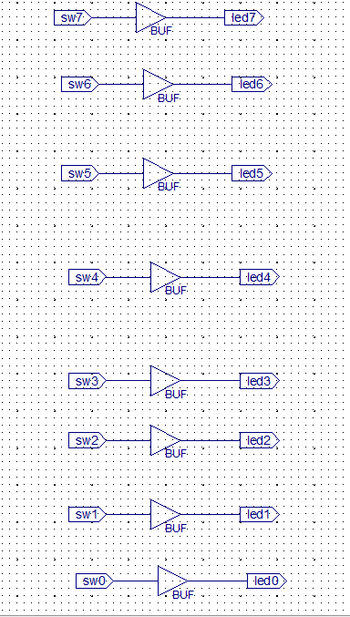
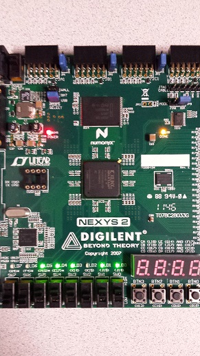
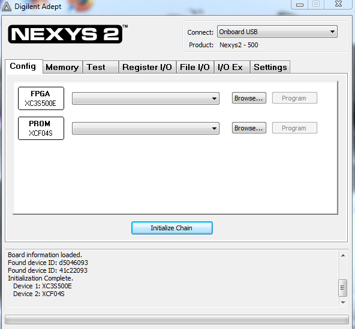

# CPX 1 - Simple FPGA Design - Dom Celiano

## Objectives/Purpose
The purpose of this computer exercise was to download and become familiar with the Xilinx development software. This software was used to create, test, and implement a design to directly connect the switches to the LEDs of the Nexys2 FPGA. This was done by first creating a simple schematic in Xilinx, testing the design, and then uploading the design through a bit file to the FPGA.

## Preliminary design and diagrams
The basic thought to attacking this problem was first understanding that there are 8 switches on the Nexys2 board, with an LED above each. By understanding that a buffer can link together the input (the switch) to the output (the LED), it was possible to create a schematic (which can be seen in Figure 1).

###### Figure 1 - This schematic shows each input going through a buffer and connecting to the output.

The theory was to make an input of '1' equal an output of '1' (i.e. LED on), and vice versa. This would be tested using a testbench before the design actually implemented onto the Nexys2 board.

## Testing procedures and data collected
After creating the schematic seen above, the first thing that was done was to use the Xilinx development software to create a testbench. Each switch would be simulated as being on for 10 ns, and the output was observed. The results of this test can be seen in Figure 2.

###### Figure 2 - As was expected, each input of 1 produced an output of 1, while each input of 0 produced an output of 0.

After the testbench had been determined as successful, the schematic was translated to the FPGA. After synthesis, converting the schematic to VHDL, implementing design, and generating the program file, the bit file was loaded onto the FPGA. The steps to this process can be seen in Figure 3.

###### Figure 3 - The program file was successfully generated and ready to be loaded onto the FPGA.

Once the program was uploaded to the FPGA, each switch was tested to see if it produced the expected output. All results came out as expected. The files were then uploaded to Git.

###### Example of switches on the FPGA turning on the LED's directly above them

## Debugging discussion
The only slight problem faced in this lab was uploading the program to the FPGA, since the Xilinx program did not recognize the USB cable from my Nexys2 board. This problem was solved by using the Digilent Adept software to upload the bitfile onto the board. Other than that, it was difficult getting used to the Xilinx software and its interaction with the Nexys2 board. Git also took some getting used to.

###### The Digilent Adept Software used to upload the bitfile.

## Answers to Lab Questions
None.

## Observations and Conclusions
Even though the circuit implemented was extremely simple, many things were learned during this assignment. I am now able to interact with the Xilinx software and implement more complex circuits in the future, increasing my capacity for digital design. I also know how to commit my files to Git - a useful tool for any project, even in my other classes. Seeing my results on a piece of hardware was also rewarding.

## Documentation statement
No help was received.
