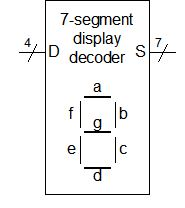
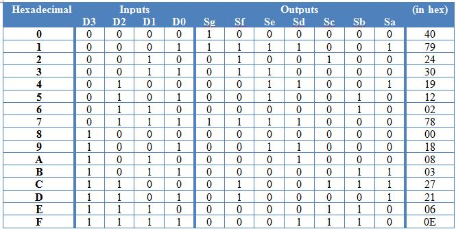
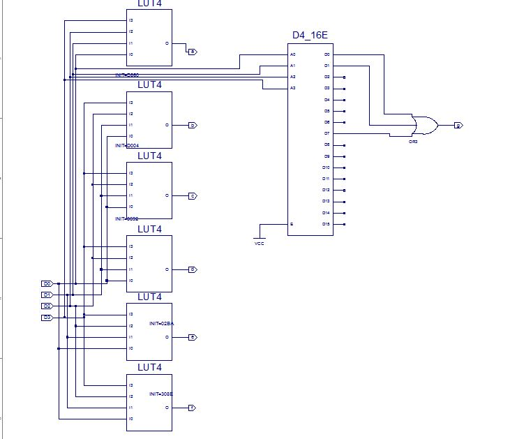
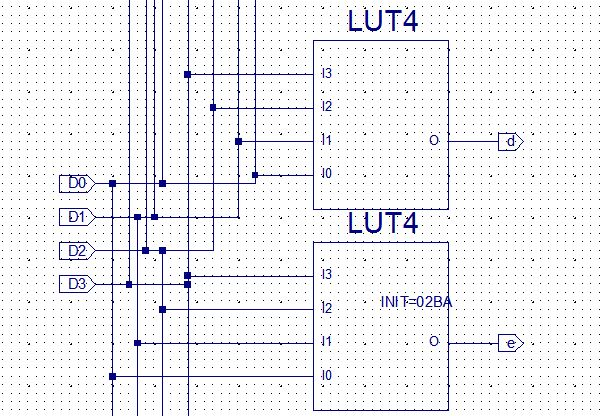
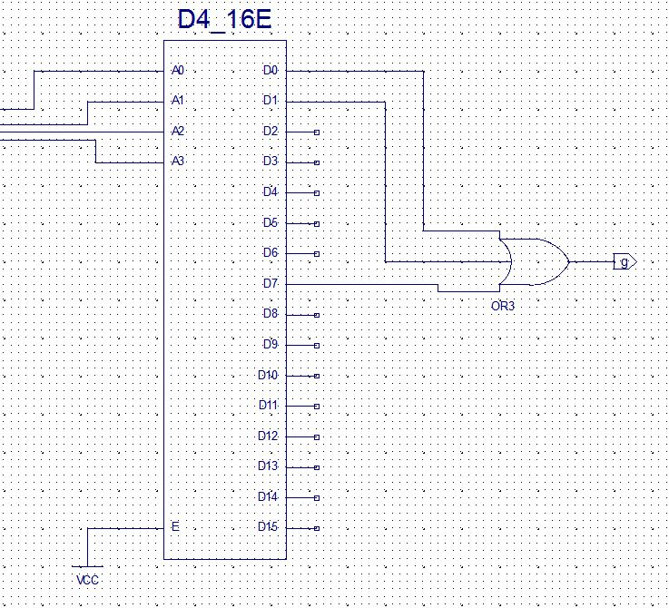
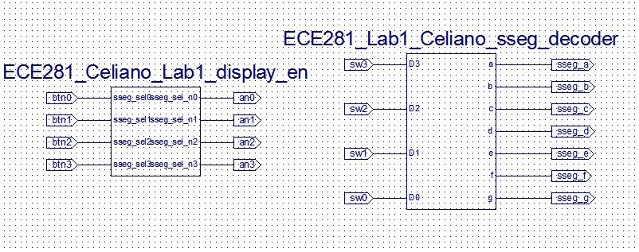
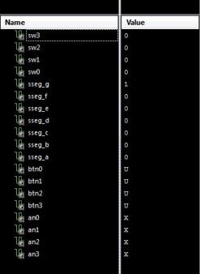

# Lab 1- Seven-Segment Display Decoder- Dom Celiano

## Objectives/Purpose
The purpose of this lab was to write, test, and implement a seven-segment decoder onto the Nexys2 FPGA board. A seven-segment display is a common way to output numbers and/or letters to the user. An input is needed to control which number/letter lights up. In this lab, the seven segment decoder used a 4-bit input to display a hex digit 0-F. This 4-bit input was done by using four switches at either low or high.

This lab also used buttons to choose which part(s) of the seven-segment would light up and display the number/letter. Whenever the button was held down, the display above that button was illuminated. The goal of this lab was to create a design, test the design using a testbench file, and then transfer the design over to hardware.

## Preliminary design and diagrams
To start the design for this decoder, the seven-segment display first needs to be analyzed. The display contains seven segments, which are lit up to form things like letters or numbers. The seven segments are labeled a to g. Placing a 0 on a segment will cause it to light up, while a 1 will not. The letters that display to each of the seven segments can be seen in  Figure 1. Using these seven segments in different combinations, different letter and number combinations can be formed to display the hex digits of 0-F. These combinations can be seen in Figure 2.

###### figure 1 - block diagram of the decoder (4 inputs, 7 outputs), as well as the letters that correspond to each of the segments of the seven segment display.

###### figure 2 - each of the hex letters, from 0 to f, that can be displayed using the seven segment display. this shows the segments which should be turned on for each hex digit.

In order to implement the logic of which segments were supposed to be lit up for each hex digit, a truth table was drawn. In Figure 3, the 4-digit binary/hex input can be seen as translated into segment outputs (low or high). Also shown in Figure 3 is the expected hex output created by the status of the seven segments.

###### figure 3 - a truth table showing the mapping between the possible inputs and outputs for the seven segment display. the hex value of the outputs for each row are in the right column.

After the truth table was filled out, K-maps were used to find the equations for each of the segment outputs (Sa, Sb, etc.). The K-map for Sa can be seen in Figure 4. All other boolean equations were found the same way.

###### figure 4 - an example k-map, which gives the function equation for segment a of the seven-segment display.

After the boolean equations were found, the actual seven-segment decoder was designed. In order to implement the decoder, there were 4 inputs (D3, D2, D1, D0), and 7 outputs (Sa-Sg). To implement the design, 6 LUT's (Look Up Tables) and 1 16-segment decoder were used. The design can be seen in Figure 5.

###### figure 5 - the zoomed out design of the seven-segment decoder. the design used 6 LUT's, 1 decoder, and had 4 inputs/7 outputs.

The LUT's (look up tables) work by having 4 inputs, and 1 output. The value of the output is based on an "INIT" value that is set by right-clicking on the LUT. This INIT values tells the look up table what memory to store inside of itself. The LUT then uses stored bits and a 4x16 decoder to perform the logic necessary that was specified by the INIT value. The number of hex digits in the LUT is equal to the number of inputs. These hex digits are determined by looking at groups of 4 bits on the output columns of the truth table, working from down to up and grouping the hex digits together. Each input combination to the LUT corresponds to a row in the truth table, while each data bit stored in the LUT corresponds to an output value. An Example LUT's can be seen in Figure 6. LUT's can be used to solve arbitrarily complex problems because they do not require a lot to be known about the problem itself. As long as you know the truth table for a problem, you can implement that problem into logic simple by looking at the inputs and outputs. In this problem, for example, anyone could have come in and done LUT's to implement the design after the truth table was finished - they didn't need to be there from the beginning.

###### figure 6 - two examples of look-up tables that are mapped to the 4 inputs and 1 output each. As can be seen in one of the lookup tables, the INIT value is 4 hex digits that stores the memory of the truth table inside the LUT.

The Decoder is a 'one-hot' decoder, which means that one output of the decoder will always display a 1, or high. Which output is high depends on the 4 inputs. Vcc was used as the enable pin for the decoder. Because I wanted the output of the decoder Sg to be low (i.e. segment is on) whenever the inputs mapped to low on the truth table, I did not care about any of the outputs from the decoder except for those which were high. I mapped all of these '1' outputs through an 'or' gate and into the output so that the output would be 0 except when the inputs into the decoder corresponded to a '1' on the truth table. If that was the case, the segment was not lit. The decoder used in the design is in Figure 7. Decoders can be used to solve arbitrarily complex problems because of the fact that they are one-high. Even if the inputs are not understood or are extremely complicated, the decoder will always output only one high value, making it easy to work backwards and discover what is actually going on.

###### figure 7 - the decoder used in the design, which takes 4 inputs and has 16 outputs. Vcc is also used as the input for enable. as can be seen, only the outputs which corresponded to a 1 are mapped through an 'or' gate and to the output g. this implements the logic correctly.

After the seven-segment decoder was finished, it was saved as its own schematic symbol and added to the top level design, seen in Figure 8. Also seen in Figure 8 is the display enable schematic symbol, which is discussed below.

###### figure 8 - the top level design for lab 1, which includes the seven-segment decoder and the display enabler. The number of inputs and outputs for each can clearly be seen.

The display enable schematic takes four active high inputs, and produces four corresponding active low outputs. The inputs are the buttons on the FPGA, while the outputs are the active-low enablers for each of the four seven segment displays. When a button is pressed, it produces a high input. However, in order to turn on the display, we want a low input. Therefore, the button signal is inverted so that when a button is pressed, it turns on the display. The schematic for implementing this design is fairly simple, and can be seen in Figure 9.

###### figure 9 - the display enable schematic. Each of the inputs (buttons) is inverted and connected to the enable switch for each of the seven-segment displays.

After the design was completed, the user constraints file was downloaded from the SharePoint site to map the inputs and outputs from the design to the input and output pins on the FPGA board.

## Testing procedures and data collected

After the design was completed, it was tested before it was implemented into hardware. To do this, a test bench file was written for the top level design. One part of the testbench was used to test the seven segment decoder schematic, while the other was used to test the display enable schematic. Examples of inputs for the testbench can be seen in Figure 10.

###### figure 10 - two sets of example inputs to be implemented and tested in the design. Testing the switches as '0000' will be a hex input of 0 (making 0 light up on the display), while testing the buttons as '1110' should result in an output of '0001', turning the three left displays on.

When the testbench was first created, the list of inputs and outputs was long and hard to read, as can be seen in Figure 11.

###### figure 11 - the initial list of inputs and outputs for the buttons, switches, segment enable, and segment output, as first loaded by the testbench file

Therefore, the outputs of the seven segments of the display were added to a virtual bus so the outputs were read as hex digits and could be easily compared to the hex values from the truth table in Figure 3. The inputs could also be tied to a virtual bus to display the inputs as hex or 4-bit binary values, but doing so is not as necessary for simple observing outputs that (since the truth table is in order of increasing binary values). The binary inputs and hex outputs can be seen in Figure 12.

###### figure 12 - the binary inputs, counting up with time, mapped to the segment outputs (in hex). The hex values output correspond to the expected values in Figure 3.

After the inputs and outputs of the seven segment decoder were confirmed to be correct, the part of the testbench that tested the display enabler was observed. The buttons being tied to the enable pins of the decoders can be seen in Figure 13. As was expected, each input was inverted to output the opposite bit. This had the effect of making a high-button press correspond to a low-input for the display enable, causing that segment to light up.

###### figure 13 - the testbench for the display enabler, which took each input and inverted it. as can be seen in the diagram, each '0' from the button turned to a '1' output to the enabler and vice versa.

Since all the testbench files confirmed that the truth table was correct and the design had been properly implemented, the next step was to upload the design onto hardware and test it. To do this, a bitfile was generated using the Xilinx software, and loaded onto the PROM of the FPGA using the Digilent Adept Software. Once this had been done, one of the buttons was held down to turn on one of the displays, while the four switches were used to test each of the 16 inputs. As can be seen by the video in Figure 14, this test was successful. I was able to count all the way from 0 to F, and each output in between worked as expected (i.e. 1110 corresponded to E).

https://www.youtube.com/watch?v=g09bSWUOte8&feature=youtu.be
###### figure 14 - video of testing out the software to ensure it counts up correctly from 0 to f. the counting is sometimes off, but all digits are displayed successfully.

Next, each of the buttons was tested to ensure that they enabled the seven segment display directly above them. Even multiple buttons were pressed at once. This test produced the expected results, and the results of it can be seen in the video in Figure 15.

https://www.youtube.com/watch?v=xMAwQHPGZj8&feature=youtu.be
###### figure 15 - a video testing each of the buttons to make sure they enable the correct seven-segment displays when pressed. the test showed the design was successful.

## Debugging Discussion

The major problem that I ran into while doing this lab was encountered when I tried to upload my bit file to my board. When I tried to do so, I kept getting an error message. When I googled this error message, I discovered that I may have selected the wrong board when I did my design. As I went back to the Xilinx software, I discovered that I had accidentally chosen the '100' model of my board instead of the '500' model, and I had run into problems because of that. So I regenerated my bit file, tried to reupload it, and still ran into issues. I rechecked my project settings, and it turns out I had not chosen 'FG320' when I had my made my project. I regenerated the bit file, and I was able to successfully upload the program after that.

## Answers to Pre-Lab Questions
1) 
a. See Preliminary design and diagrams

b. For each output (Sa, Sb, Sc, etc.), if I had to implement either the SOP or POS in hardware, I would choose to use a sum of products. This is because the majority of the outputs to the 7-segment display in each column are 0’s. When the SOP equation is written, it will only be necessary to look at the ‘1’ outputs, so there will be a smaller number of terms in the equation to look at, making a more simplified equation and a smaller amount of gates necessary to use.

c. Using Sum of Products Method for Sa:
Sa = D0D1’D2’D3’ + D0’D1’D2D3’ + D0D1D2’D3 + D0’D1’D2D3 + D0D1’D2D3,
Sa = D0D1’D2’D3’ + D0’D1’D2D3’ + D0D1D2’D3 + D0’D1’D2D3 + D0D1’D2D3 + D0’D1’D2D3,
Sa = D0D1’D2’D3’ + D0’D1’D2 (D3 + D3’) + D0D1D2’D3 + D1’D2D3(D0 + D0’),
Sa = D0D1’D2’D3’ + D0’D1’D2 + D0D1D2’D3 + D1’D2D3.
For all the other equations, K-maps were used since they took less time (see above section).

d. The final, simplified boolean equations are:
Sa = D0’D1’D2 + D1’D2D3 + D0D1’D2’D3’ + D0D1D2’D3,
Sb = D0’D2D3 + D0D1D3 + D0’D1D2 + D0D1’D2D3’,
Sc = D1D2D3 + D0’D2D3 + D0’D1D2’D3’,
Sd = D0D1’D2’ + D0D1D2 + D0’D1’D2D3’ + D0’D1D2’D3,
Se = D1’D2D3’ + D0D1’D2’ + D0D3’,
Sf = D1’D2D3 + D1D2’D3’ + D0D1D3’ + D0D1’D2’D3’,
Sg = D1’D2’D3’ + D0D1D2D3’

## Observations and Conclusions

This lab was important because, like CPX1 and CPX2, it focused heavily on design and implementation. Like CPX1, I was exposed to all sorts of new tools that I had not previously learned in the classroom. Learning how to use LUT's, for example, is an extremely useful tool that I will likely use on later labs. And while I had already learned about decoders in the classroom, actually putting what I learned into pratice taught me a lot more about what a decoder actually is. Also in this lab, I further reinforced how important it is to do simulations. While I did not catch any specific errors when I performed my simulation, it is completely possible that I could make a silly mistake in the future. I want to catch that mistake before I generate a bit file and upload my program onto software. Overall, this lab was an extremely beneficial learning process. It was cool to see my design translated onto real hardware, and especially cool to see the seven segment display light up.

## Documentation statement
C3C Braden Laverick helped me understand what the enable buttons were supposed to do in the simulation.
