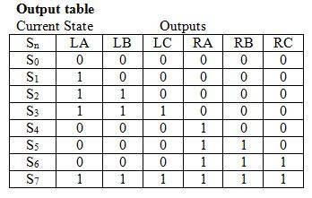

# Lab 3 - Thunderbird Turn Signal - Dom Celiano

## Objectives/Purpose
The purpose of this lab was to design, write, test, and implement in hardware using VHDL a finite state machine to simulate the taillights of a 1965 Thunderbird. The lights of the T-bird light sequentially when the left or right blinker is pressed, as seen below in Figure 1.

###### FIGURE 1 - the turn signal lighting sequence of the 1965 ford thunderbird. LA-LC represents the left blinker, while RA-RC is the right blinker. After the sequence is finished, all the lights turn off.
In order to create this lighting sequence, an FSM was written and tested, and eventually transfered over to the Nexys2 FPGA board.

## Preliminary design and diagrams
To start, each of the 6 lights to be simulated on the Thunderbird were given a name: LA, LB, LC, RA, RB, and RC. This labeling can be seen in Figure 2.

###### FIGURE 2 - the 6 labels for the tail lights of the thunderbird. these labels correspond to figure 1.
After each of the lights were labeled, a state transition diagram was created to show the different states that the lights could be in and the transitions between the states. This diagram can be seen in Figure 3.

###### FIGURE 3 - the state transition diagram for the thunderbird FSM. The FSM contains 8 states, s0-s7. s0 is a state in which all the lights are off. from that state, the fsm can move to the left turning sequence, the right turning sequence, or a 'hazard light' scenario in which both the right and left inputs were given.
As can be seen in this state diagram, the FSM starts out in S0 and reverts back to S0 after each light sequence. The sequence of S1-S3 occurs when only a left input is given, while the sequence of S4-S6 occurs when only a right input is given. The S7 sequence is the hazard lights and occurs when both right and left inputs are given. Inside the circles of the state diagram, the output (high or low) of each of the 6 LEDs is given. Another important point to note in this diagram is that after any of the three light sequences are entered, it does not matter what input is given by the user - they will move through their entire sequence and then return to s0.

Once the state diagram for the Thunderbird FSM had been created, it was time to write out the next state table and next state equation. These tables and equations would make writing the VHDL code later a lot easier. The result of this work can be seen in Figures 4 and 5.

###### FIGURE 4 - the next state table for the thunderbird fsm. the current state is on the left, the three possible inputs in the middle, and the next state on the right of the table. This table was created by looking at the arrows on the state diagram in figure 3.

###### FIGURE 5 - the next state equations for the thunderbird fsm, derived from the next state table in figure 4. these were useful when writing the vhdl code.
After the next state table and equations were worked out, it was time to move onto the output table and output equations. These can be seen in Figures 6 and 7.

###### FIGURE 6 - output table for the thunderbird fsm. the 6 led outputs depend on the current state of the fsm, and are determined by looking at the state diagram in figure 3.

###### FIGURE 7 - output equations for the thunderbird fsm, determined using the table in figure 6. these equations were extremely helpful when the vhdl code was written.
After the next state and output logic was determined to help write the VHDL code, it was finally time to dive into the VHDL code. The FSM had 4 inputs: left, right, reset, and the clock and 6 outputs: the 6 LEDs. The output was split up into 2 busses of 3 LEDs, with each bus representing the left or right taillight. The first thing that was necessary to do was to define the 8 state types that were possible: S0-S7. Once that was done, the signals 'state' and 'nextstate' were defined to be of type statetype. This let these signals take on the values of S0-S7. This code can be seen in Figure 8.

###### FIGURE 8 - the 8 different statetypes as well as defining the state and nextstate signals as types of those statetypes.
After the state and nextstate signals were defined, it was time to move into the state register part of the VHDL code. A process was created that only ran when clk or reset changed, and changed the state to next state on the rising edge of the clock. 

After the state register part of the VHDL code was written, the next state logic portion of the code was written. This was where the next state table and equations from Figures 4 and 5 came in handy. Using those tables and a case statement, I was able to say that when we were in a current state and the inputs were certain values, we should move to a certain new state. This case statement was inside of a process that was only run when the left or right inputs changed. An example of the code can be seen in Figure 9.

###### FIGURE 9 - an example of next state code - this code shows all the next states based on the inputs if we start out in state s0.
Since the next state logic was now implemented into VHDL, it was time to move onto the output logic. To make writing this code a lot easier, the output table and equations from Figures 6 and 7 were used. Each of the 3 outputs on the left and right busses were set to match the logic equations from Figure 7. An example of the output code can be seen in Figure 10.

###### FIGURE 10 - example output code for the thunderbird fsm. This code shows in which states the 2nd light of the left bus will be enabled/turned on.
Now that the VHDL code for the Thunderbird FSM was written, I ensured that it was working correctly. These tests can be seen below in the next section.

I then moved onto writing my top.vhd file. Before I did this, I grabbed the clock_divider.vhd file from the ECE281 course website. This file was necessary to slow down the 50MHz clock of the Nexys2 board into something slower that can be seen by the human eye. This way, I could actually see the lights on the FPGA functioning.

The top.vhd file used a structural architecture that used the two components of the clock divider and the thunderbird FSM to create a top level design with 4 inputs and 6 outputs (the LEDs). Other than defining these two components a signal that was internal to the system also needed to be defined. This signal would take the output of the clock_divider, the slowed clock signal, and input it into the thunderbird FSM so the lights of the thunderbird would be visibly updated. The components and signals can be seen in Figure 11.

###### FIGURE 11 - the components and signals that make up the top.vhd structural architecture. the inputs and outputs of each component can be seen.
The next step was then to do the port map for each of the components. The purpose of the port maps was to define the inputs and outputs going into or out of each 'box' in accords with the top level design. For example, the thunderbird FSM was assigned inputs of the slowed clock and the three other switches, while its outputs were the 5 LEDs. The inputs to the clock divider, on the other hand, were the fast clock and the reset. Its output was the slowed clock, the signal which was fed into the thunderbird FSM to make the light visible.

After the top.vhd file had successfully implemented the thunderbird FSM with a slowed clock using the clock_divider.vhd file, it was time to think about moving the FSM into hardware. To do this, a .ucf file was written to tie the inputs to switches and the clock and the outputs to LEDs. 6 LEDs were used, 1 input was the 50MHz clock of the Nexys2, and 3 switches were used as the reset, left, and right inputs. The hardware was then tested on the FPGA to make sure the LED's blinked correctly.

## Testing procedures and data collected
After the thunderbird FSM was designed and implemented using VHDL code, it needed to be tested using a testbench file. For the testbench file, the 'stimulus' inserted was to enter the left turning sequence to ensure it worked, then enter the right turning sequence, then the hazard sequence, and finally test some of these sequences with unusual inputs (reset, etc.). Figure 12 shows the first part of the result of the testbench simulation. The FSM starts in the reset state, and then moves into the left turning sequence.

###### FIGURE 12 - first part of thunderbird testbench showing a left turn sequence after being in state s0. the left input is given with the reset and right off, and so the vehicle moves into the left turning sequence, going to state s1 then s2 then s3 then back to s0. the outputs of the leds can be seen.
After ensuring that the left turning sequence worked, it was time to move onto the right turning sequence. The inputs of left and reset were set at 0, while the right input was set to high. This set the FSM from s0 into a right turning sequence. The results of this simulation can be seen in Figure 13.

###### FIGURE 13 - right hand turning sequence. the right input is set to high, and the right lights consequently light up as expected. the fsm goes from state s0 to s4 to s5 to s6 and finally back to the reset state, s0.
Since both the left and right turning sequence patterns worked correctly in thier most basic form, it was then necessary to test the hazard lights and various different cases where the reset was on to ensure the FSM would react as expected. The results of these simulations can be seen in Figure 14. To test the hazard lights, the inputs of left and right were given at the same time, with reset off. When this happened, it was expected that all the lights would turn on for a clock cycle and then turn off. The output matched what was expected. Then, a reset was given just as the FSM went into a left turning sequence then a right turning sequence. As expected, the FSM went back to state S0 after the reset input was given.

###### FIGURE 14 - hazard lights and reset simulation results from the thunderbird testbench. in the first part of this image, the left and right inputs are set to high to test that the hazard lights all turn on and then off continuously. then, a left turning sequence is entered, but not soon after a reset is thrown. this reset makes the fsm go back to state s0. a right turning sequence is then entered, but once reset is pressed again the fsm goes back to state s0 with all lights off.
Testing it in hardware was a fairly easy task. A .bit file was generated from the top.vhd file, and was uploaded to the Nexys2 board using the Digilent Adept software. All possible test cases were then tested - similar to what was done with the testbench file. See the Youtube video below for a video with explanations of what is happening.
Link: https://www.youtube.com/watch?v=w94CGdJfoDA&feature=youtu.be

## Debugging discussion
One of the main problems I faced in this lab was getting my Thunderbird FSM Testbench to work properly. After much debugging and testing, and some help from my classmate C3C Torres, I was able to determine that my problem was contained inside one of my processes. For my next state logic in my thunderbird FSM code, my code was in a process that only updated when left or right was changed, not when clock or reset was changed. Therefore, my next state was not updating properly on each clock cycle or reset. This was giving me a lot of problems with my code, but I eventually figured it out by making the process(left, right, clk, reset) to fix all the errors I was getting.

Although I learned a lot from this problem, it was the only big one that I faced.

## Answers to Lab Questions
None.

## Observations and Conclusions
This lab was a good follow-up to the last lab. Instead of having to figure out an encoding scheme for the FSM and draw out all of the schematics, it was much easier and quicker to just write the VHDL code. While we just started learning VHDL a few lessons ago, jumping into it with a lab like this one was a good learning experience. Being able to do something cool like simulating the lights of a 1965 Thunderbird was also really cool.

One thing I especially learned through doing this lab is that it is extremely important to keep track of your busses and LED's and how they are linked to each other. It is pretty easy to get confused on what LED is corresponding to what output, and therefore it is necessary to really pay attention to what is going on. Overall, however, this lab truly was a good learning experience and a good follow-up to a VHDL intro.

## Documentation statement
C3C Lance Torres helped me understand how to implement the structural architecture of the top.vhd file as well as debug my thunderbird testbench.
